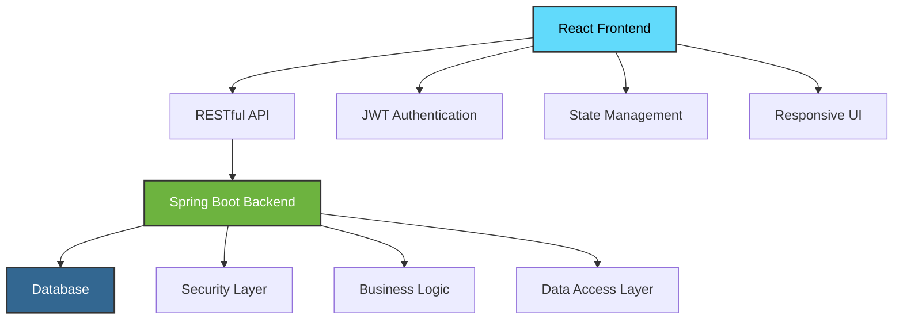

# 🔍 Lost & Found Portal

<div align="center">


**A modern, full-stack Lost & Found management system**

[](https://reactjs.org/)
[](https://www.typescriptlang.org/)
[](https://spring.io/projects/spring-boot)
[](https://www.oracle.com/java/)

[🚀 Live Demo](https://your-demo-link.com) • [📖 Documentation](https://your-docs-link.com) • [🐛 Report Bug](https://github.com/yourusername/lost-found-portal/issues) • [💡 Request Feature](https://github.com/yourusername/lost-found-portal/issues)

</div>

---

## 📋 Table of Contents

- [🌟 Features](#-features)
- [🏗️ Architecture](#️-architecture)
- [🚀 Quick Start](#-quick-start)
- [📁 Project Structure](#-project-structure)
- [🔧 Installation](#-installation)
- [🌐 API Documentation](#-api-documentation)
- [👥 User Roles](#-user-roles)
- [🎨 UI/UX Highlights](#-uiux-highlights)
- [🔒 Security](#-security)
- [🧪 Testing](#-testing)
- [📱 Mobile Support](#-mobile-support)
- [🤝 Contributing](#-contributing)
- [📄 License](#-license)

---

## 🌟 Features

<table align="center">
<tr>
<td align="center" width="33%">

### 🔐 **Authentication**
- JWT-based secure login
- Role-based access control
- Password strength validation
- Session management

</td>
<td align="center" width="33%">

### 📦 **Item Management**
- Lost & Found item tracking
- Image upload support
- Status management
- Advanced search & filters

</td>
<td align="center" width="33%">

### 👥 **User Management**
- Multi-role user system
- Profile management
- Admin dashboard
- User activity tracking

</td>
</tr>
<tr>
<td align="center" width="33%">

### 📋 **Request System**
- Claim requests
- Status tracking
- Automated notifications
- Request history

</td>
<td align="center" width="33%">

### 📱 **Responsive Design**
- Mobile-first approach
- Cross-browser compatibility
- Modern UI components
- Accessibility features

</td>
<td align="center" width="33%">

### ⚡ **Performance**
- Optimized API calls
- Lazy loading
- Efficient state management
- Fast page loads

</td>
</tr>
</table>

---

## 🏗️ Architecture



### Tech Stack

| Layer | Technology | Purpose |
|-------|------------|---------|
| **Frontend** | React 18 + TypeScript | Interactive user interface |
| **Styling** | CSS Modules | Scoped, maintainable styles |
| **State Management** | React Context + Hooks | Application state |
| **HTTP Client** | Fetch API | API communication |
| **Backend** | Spring Boot + Java | RESTful API server |
| **Authentication** | JWT | Secure token-based auth |
| **Alerts** | SweetAlert2 | User feedback & confirmations |

---

## 🚀 Quick Start

### Prerequisites

- **Node.js** 16.0 or higher
- **npm** 8.0 or higher
- **Java** 11 or higher
- **Maven** 3.6 or higher

### 30-Second Setup

```bash
# Clone the repository
git clone https://github.com/yourusername/lost-found-portal.git
cd lost-found-portal

# Install frontend dependencies
npm install

# Start development server
npm start

# Backend setup (separate terminal)
cd backend
mvn spring-boot:run
```

🎉 **That's it!** Your application should now be running at `http://localhost:3000`

---

## 📁 Project Structure

```
lost-found-portal/
├── 📂 public/                  # Static assets
│   ├── index.html             # HTML entry point
│   └── ...
├── 📂 src/                    # Source code
│   ├── 📄 App.tsx             # Main application component
│   ├── 📂 components/         # React components
│   │   ├── 📂 Auth/           # Authentication components
│   │   │   ├── SignIn.tsx
│   │   │   ├── SignUp.tsx
│   │   │   └── AuthProvider.tsx
│   │   ├── 📂 Common/         # Shared components
│   │   │   ├── NotFound.tsx
│   │   │   ├── UnAuth.tsx
│   │   │   └── styles.module.css
│   │   ├── 📂 Items/          # Item management
│   │   │   ├── ItemConsole.tsx
│   │   │   └── EditItem.tsx
│   │   ├── 📂 NavBar/         # Navigation
│   │   ├── 📂 Requests/       # Request management
│   │   └── 📂 Users/          # User management
│   ├── 📂 service/            # API services
│   │   ├── Auth.ts
│   │   ├── ItemData.ts
│   │   ├── RequestData.ts
│   │   └── UserData.ts
│   └── 📄 index.tsx           # Application entry point
├── 📄 package.json            # Dependencies & scripts
├── 📄 tsconfig.json           # TypeScript configuration
└── 📄 README.md               # This file
```

---

## 🔧 Installation

### Development Environment

1. **Clone & Navigate**
   ```bash
   git clone https://github.com/yourusername/lost-found-portal.git
   cd lost-found-portal
   ```

2. **Install Dependencies**
   ```bash
   npm install
   ```

3. **Environment Setup**
   ```bash
   # Create environment file
   cp .env.example .env
   
   # Edit your environment variables
   nano .env
   ```

4. **Start Development Server**
   ```bash
   npm start
   ```

### Production Build

```bash
# Build optimized production bundle
npm run build

# Serve production build locally (optional)
npx serve -s build
```

### Available Scripts

| Command | Description |
|---------|-------------|
| `npm start` | Start development server |
| `npm run build` | Create production build |
| `npm test` | Run test suite |
| `npm run eject` | Eject from Create React App |
| `npm run lint` | Run ESLint |
| `npm run format` | Format code with Prettier |

---

## 🌐 API Documentation

### Base URL
```
http://localhost:8085/lostandfound/api/v1/
```

### Authentication Endpoints

| Method | Endpoint | Description | Body |
|--------|----------|-------------|------|
| `POST` | `/auth/signup` | Register new user | `{email, password, name, mobile}` |
| `POST` | `/auth/signin` | User authentication | `{email, password}` |

### User Management

| Method | Endpoint | Description | Auth Required |
|--------|----------|-------------|---------------|
| `GET` | `/users/getallusers` | Fetch all users | ✅ Admin |
| `GET` | `/users/getuserbyemail?email={email}` | Get user by email | ✅ |
| `POST` | `/users` | Create new user | ✅ Admin |
| `PATCH` | `/users?userId={id}` | Update user | ✅ Admin |
| `DELETE` | `/users?userId={id}` | Delete user | ✅ Admin |

### Item Management

| Method | Endpoint | Description | Auth Required |
|--------|----------|-------------|---------------|
| `GET` | `/items/getallitems` | Fetch all items | ✅ |
| `POST` | `/items` | Create new item | ✅ |
| `PATCH` | `/items?itemId={id}` | Update item | ✅ |
| `DELETE` | `/items?itemId={id}` | Delete item | ✅ Staff |

### Request Management

| Method | Endpoint | Description | Auth Required |
|--------|----------|-------------|---------------|
| `GET` | `/requests/getallrequests` | Fetch all requests | ✅ |
| `POST` | `/requests` | Create new request | ✅ |
| `PATCH` | `/requests?requestId={id}` | Update request | ✅ |
| `DELETE` | `/requests?requestId={id}` | Delete request | ✅ Staff |

### Authentication Header
```javascript
Authorization: Bearer <jwt_token>
```

---

## 👥 User Roles

<table>
<tr>
<th>Role</th>
<th>Permissions</th>
<th>Access Level</th>
</tr>
<tr>
<td><strong>🔵 USER</strong></td>
<td>
• View items<br>
• Submit requests<br>
• View other users<br>
</td>
<td>Basic Access</td>
</tr>
<tr>
<td><strong>🟡 STAFF</strong></td>
<td>
• All USER permissions<br>
• Manage items<br>
• User Management<br>
• Process and manage requests<br>
• View all requests
</td>
<td>Elevated Access</td>
</tr>
<tr>
<td><strong>🔴 ADMIN</strong></td>
<td>
• All STAFF permissions<br>
• User management<br>
• System configuration<br>
• Full access to all features
</td>
<td>Full Access</td>
</tr>
</table>

---

## 🎨 UI/UX Highlights

### Design Principles

- **🎯 User-Centric**: Intuitive navigation and clear information hierarchy
- **📱 Mobile-First**: Responsive design that works on all devices

### Key UI Components

| Component | Description | Features |
|-----------|-------------|----------|
| **Navigation** | Persistent nav bar | Context-aware links, dropdowns |
| **Data Tables** | Modern item listings | Sorting, filtering, pagination |
| **Forms** | Add/Edit modals | Real-time validation, error feedback |
| **Alerts** | User feedback | Success/error states, confirmations |

### Visual Features

- 🎨 **Modern Color Palette**: Professional blue, purple and gray tones
- 📐 **Consistent Spacing**: 8px grid system
- 🔤 **Typography**: Clean, readable font hierarchy
- 🎭 **Interactive Elements**: Hover effects and micro-animations
- 🌙 **Status Indicators**: Color-coded badges and icons

---

## 🔒 Security

### Frontend Security

- ✅ **JWT Token Management**: Secure token storage and refresh
- ✅ **Route Protection**: Private routes with authentication guards
- ✅ **Input Validation**: Client-side form validation
- ✅ **XSS Prevention**: Sanitized user inputs
- ✅ **HTTPS Enforcement**: Secure communication protocols

### Password Requirements

```javascript
// Password must contain:
- Minimum 8 characters
- At least 1 uppercase letter
- At least 1 lowercase letter  
- At least 1 number
- At least 1 special character
```

### API Security

- 🔐 **JWT Authentication**: Stateless token-based auth
- 🛡️ **Role-Based Access**: Endpoint-level authorization
- 🔒 **CORS Configuration**: Controlled cross-origin requests

---

## 📱 Mobile Support

### Responsive Breakpoints

| Device | Screen Size | Layout |
|--------|-------------|--------|
| **Mobile** | < 768px | Single column, collapsible nav |
| **Tablet** | 768px - 1024px | Two-column, condensed tables |
| **Desktop** | > 1024px | Full layout, expanded features |

---

## 🙏 Acknowledgments

- [React](https://reactjs.org/) - Frontend framework
- [Spring Boot](https://spring.io/projects/spring-boot) - Backend framework
- [SweetAlert2](https://sweetalert2.github.io/) - Beautiful alerts
- [Create React App](https://create-react-app.dev/) - Project bootstrap

---

<div align="center">

**⭐ Star this repository if you find it helpful!**

[🔝 Back to Top](#-lost--found-portal)

---

Made with ❤️ by [Ashan Manamperi](https://github.com/dettlaff404)

</div>